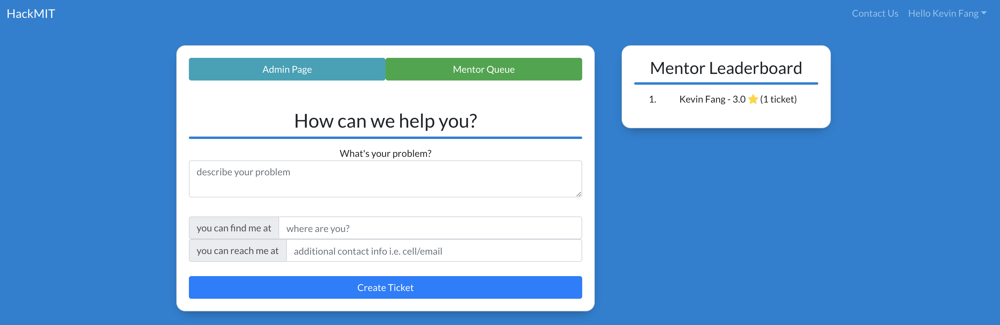
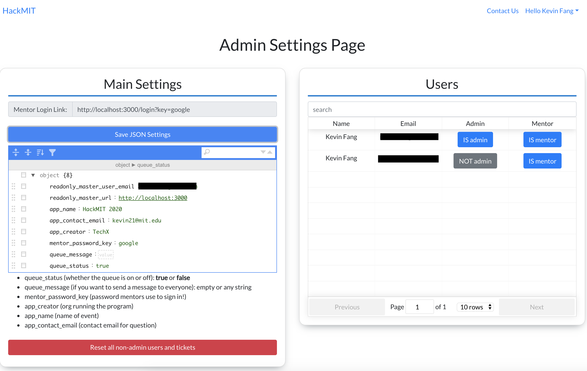

# Help Queue

The easy to use help queue system, built on top of Flask + React! 

Created and maintained by: [TheReddKing](mailto:kevin21@mit.edu) ([TechX](https://techx.io))

### Heroku Deploy

There are two variables you need to set the master email account and also the URL of the site. These must be edited as heroku env variables.
All other settings can be edited on the `/admin` page

### Screenshots

## Dev:
### Local Installation:

    python -m venv env
    source env/bin/activate
    pip install --upgrade pip
    pip install -r requirements.txt
    yarn
    cp .env.example .env
    cd client && yarn

Then edit your `.env` file. Once your database url is correct (you can use `createdb helpq` if you have postgres)

    python manage.py db upgrade

### Dev run

    yarn run dev
    
or (if you want to debug server side scripts)

    yarn start
    yarn run dev-server

Contributing
------------

I'd love to take pull requests! Please read the [Contributing Guide](CONTRIBUTING.md) first!

Other TODOs:
- App Success Deploy
{
  "success_url": "/welcome"

}
